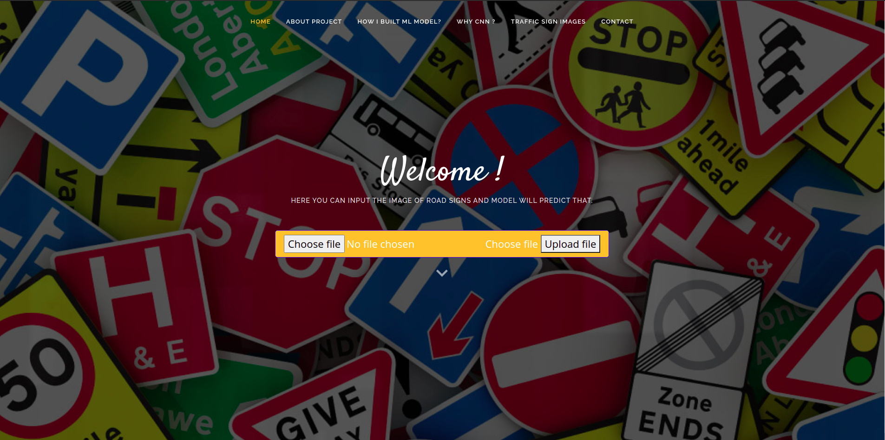

# Live web-app link:
- https://traffic-sign-recognition2701.herokuapp.com/

# Traffic-Sign-Recognition
- This is my 7th semester mini-project which is basically about recognising 42 types traffic signs and i made web app and deployed over heroku platform. I have used CNN classification algorithm and GTSRB - German Traffic Sign Recognition Benchmark dataset from kaggle.
- Welcome page of web-app

  

# Dataset source
- https://www.kaggle.com/meowmeowmeowmeowmeow/gtsrb-german-traffic-sign

# Now let's describe project.

## Why i took this project?
- As we all know from now on all things and mechanisms are becoming automatic and the best example of that is <b>Tesla's self driving car</b>. we all know Elon musk and heard about Tesla's self- Driving car. So one out of thousands factor which helps car to drive itself is traffic sign detection and recognition so basically i thought about let's make one part of it so here i made it. Obviously Self driving car has much better model's accurcay and all but here is one intution.

## What I used to build this mini project ?
- I have used most off CNN and different languages to build this mini project. To build the model and train the model I have used python language and CNN architecture. To build this website I have used HTML, CSS, JavaScript and Bootstrap framework. and here is time i spent on each Technology.

## Directory/files - Working

- models : different trained model
- static : CSS, icons and JS files ( This is structure of flask microservice )
- templates : HTML files
- Procfile : required to deploy web-app on heroku platform.
- app.py : flask python file for making apis
- requirements.txt : dependencies and libraries i have used to make this project.
- welcome_page.png : screenshot of home page of deployed web-app

## Requirements

- First run following command to download external library
- python3 -m pip install -r requirement.txt
- After completed go to Run part.

## How to start Flask-Server

- Go to project directory then run following command
- python3 app.py
- go to link given in terminal during starting kernel

### Reference_links

- https://towardsdatascience.com/a-comprehensive-guide-to-convolutional-neural-networks-the-eli5-way-3bd2b1164a53
- https://www.geeksforgeeks.org/deploy-python-flask-app-on-heroku/

# Thank You 
- Any feedback will be appriciated.
